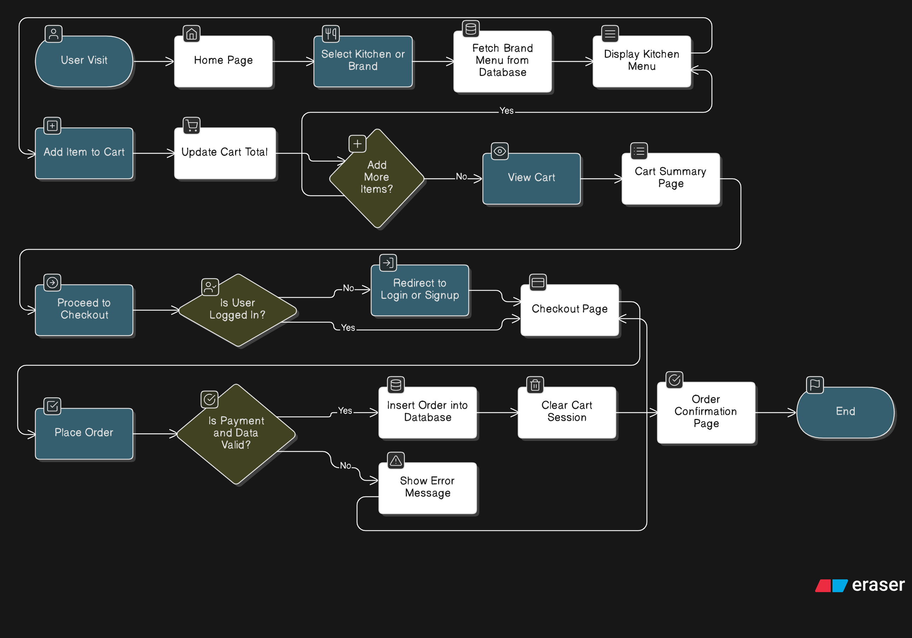
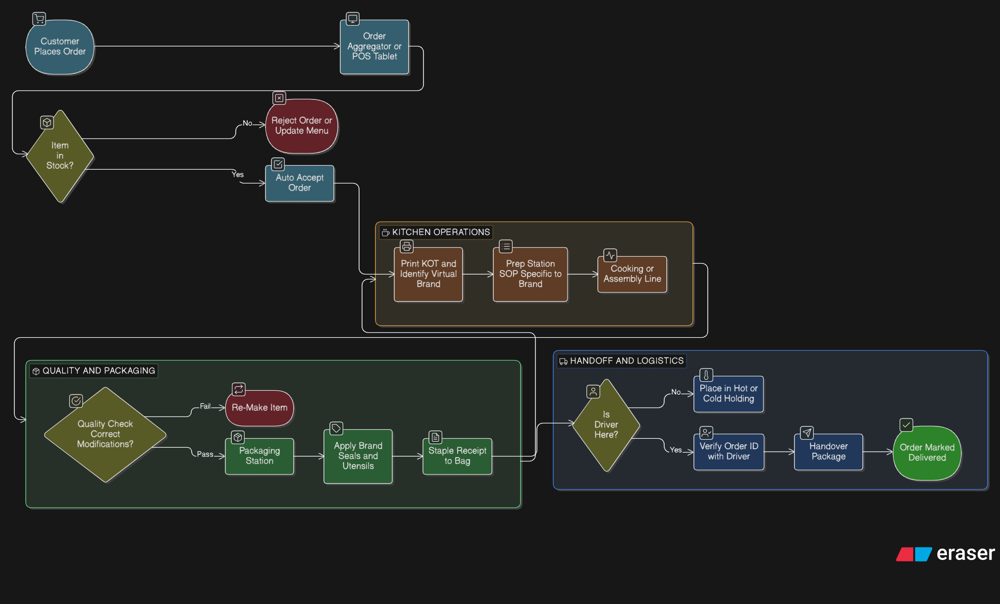
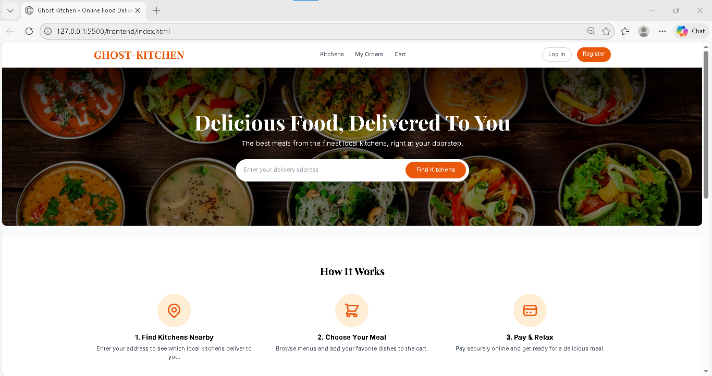
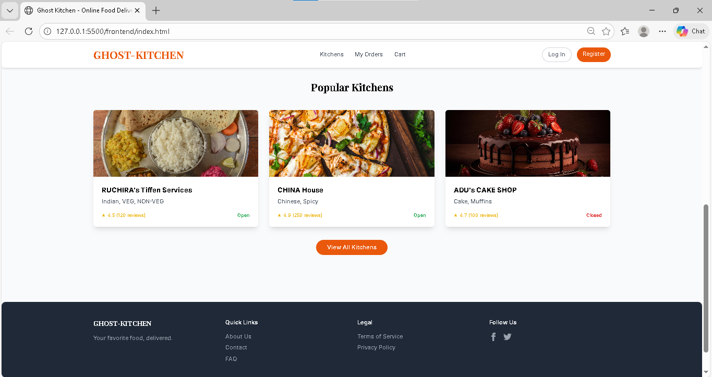
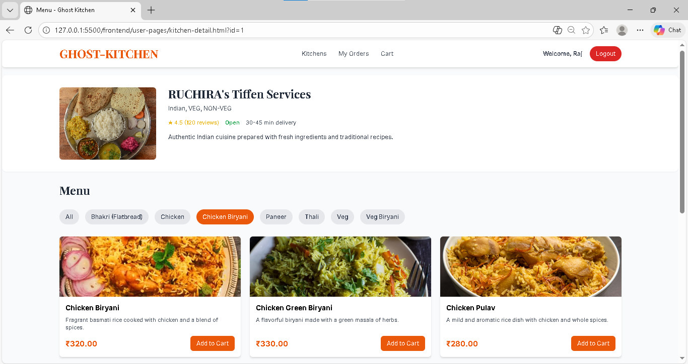
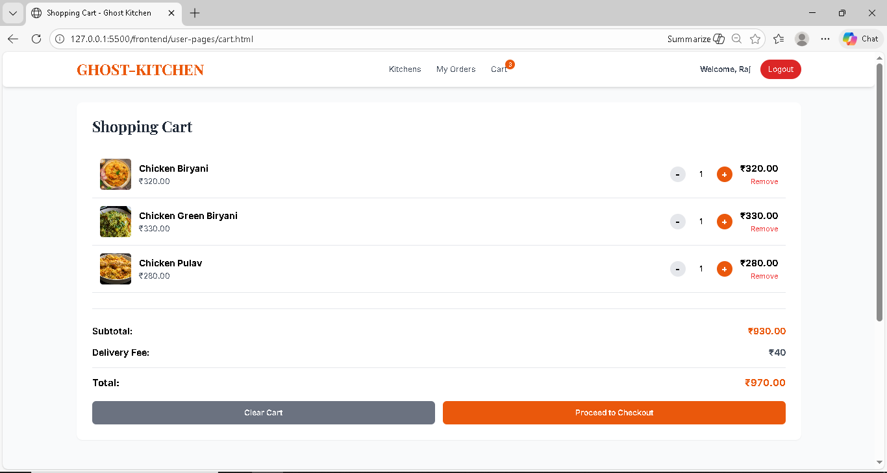
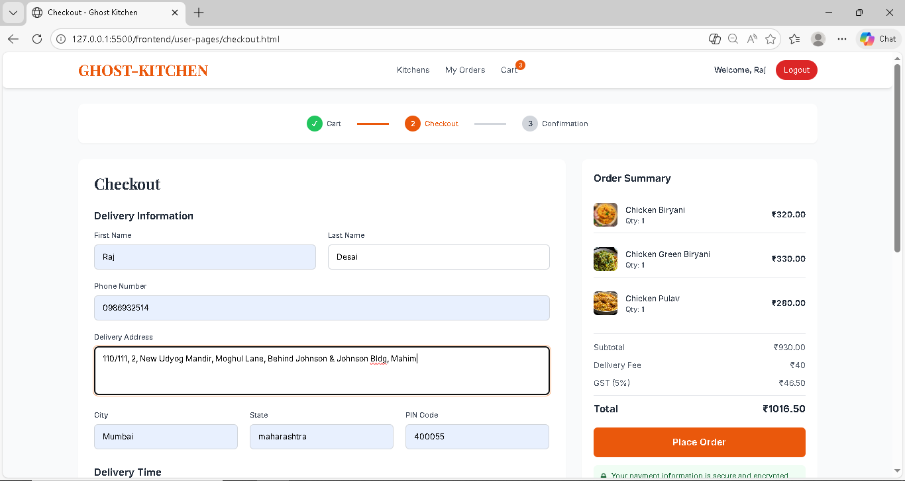
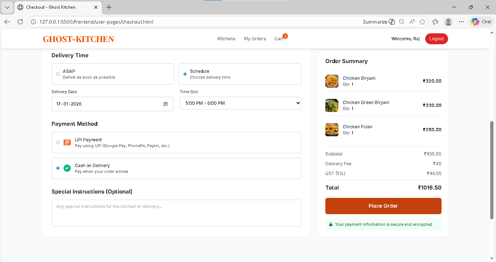
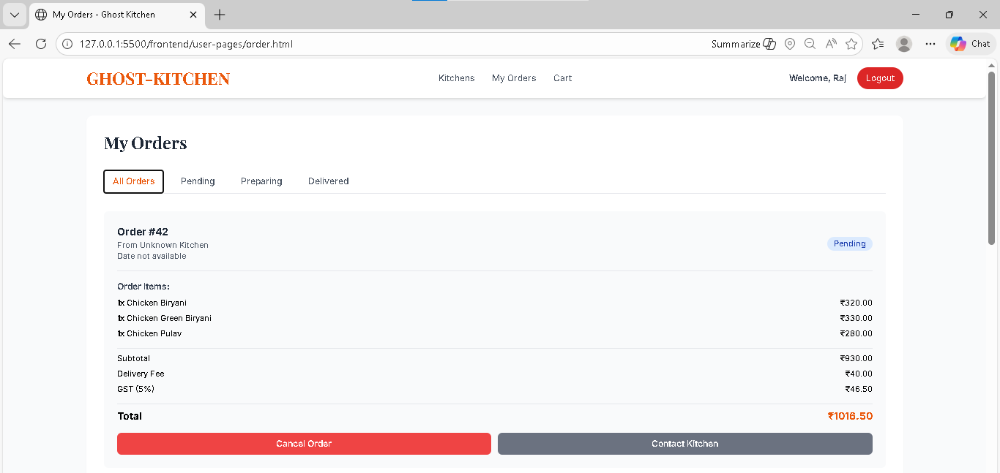

#  Ghost Kitchen Management System

> **Final Year Project | Sathaye College | BSc Information Technology (2023-2026)** <br />
> **Live Demo:** [https://ghost-kitchen-one.vercel.app/](https://ghost-kitchen-one.vercel.app/)

##  Introduction
This project is a fully functional web-based application designed to manage the operations of a **Ghost Kitchen** (Cloud Kitchen). Unlike traditional dining, ghost kitchens focus solely on delivery. This system connects customers with multiple virtual kitchen brands, managing the entire flow from order placement to kitchen processing.



##  Why We Chose This Topic?
We selected the **Cloud Kitchen** model for our final year project because:

1. **Industry Trend:** It addresses the booming demand for delivery-only food models.
2. **Complex Data Handling:** It solves a "Many-to-Many" operational problem (One Platform  Many Kitchens  Many Customers), demonstrating advanced backend logic.
3. **Real-World Utility:** It creates a centralized dashboard for managing menus, orders, and kitchen performance without physical storefronts.


## Technologies Used

* **Frontend:**
  * **React.js:** (Uses functional components, hooks like `useState` and `useEffect`, and Context API for global state like Cart and Auth).
  * **Tailwind CSS:** (Utility-first CSS framework used for all styling, replacing standard CSS3).
  * **React Router DOM:** (Handles seamless client-side routing between pages like `/kitchens`, `/admin/dashboard`, and catching `404` errors).
  * **Axios:** (Promise-based HTTP client used to fetch data from your backend API).

* **Backend:**
  * **Node.js:** Server-side runtime environment.
  * **Express.js:** Web framework used for structured routing (`/api/kitchens`, `/api/orders`, `/api/admin`).
  * **JSON Web Tokens (JWT):** Secure authentication system used to generate "VIP Passes" and enforce role-based access control (Customer vs. Super Admin vs. Kitchen Owner).
  * **MySQL2:** Promise-based Node.js driver used to execute secure SQL queries and prevent database crashes.

* **Database:**
  * **MySQL:** Relational database managed via `config/database.js`, storing normalized tables for `users`, `kitchens`, `menu_items`, and `orders`.


###  Team Members
* **Prasanna Dolas**
* **Omkar Ugale**
* **Rushikesh Ahierkar**
* **Aryan Gamre**

## Project Contributions

| Module / Component | Contributors | Key Responsibilities |
| :--- | :--- | :--- |
| **Frontend UI/UX** | **Prasanna Dolas**<br>**Omkar Ugale** | Developed React components, Tailwind styling, and Vercel deployment configuration. |
| **Authentication & Auth** | **Omkar Ugale**<br>**Rushikesh Ahierkar** | Implemented JWT logic, session persistence, and frontend route guarding. |
| **Backend API** | **Aryan Gamre**<br>**Prasanna Dolas** | Developed Express routes, Render server configuration, and SSL database pooling. |
| **Database Architecture** | **Rushikesh Ahierkar**<br>**Prasanna Dolas** | Normalized MySQL schema design and migration to TiDB Cloud. |


##  Project Structure

This diagram reflects the exact folder hierarchy from your project source code:

```text
GHOST-KITCHEN/
├── backend/                    # Node.js & Express server environment
│   ├── config/                 # Database connection settings (database.js)
│   ├── controllers/            # Business logic for APIs (adminController.js, etc.)
│   ├── middleware/             # JWT authentication & role protection (auth.js, adminAuth.js)
│   ├── routes/                 # API endpoints (admin.js, kitchens.js, order.js, etc.)
│   ├── server/                 # Additional server configurations
│   ├── .env                    # Environment variables (DB URL, JWT Secret)
│   ├── package.json            # Backend dependencies
│   └── server.js               # Main backend entry point & server setup
│
├── frontend/                   # React.js client application
│   ├── public/                 # Static assets
│   ├── src/
│   │   ├── components/         # Reusable UI components
│   │   │   ├── admin/          # Admin-specific components (AdminSidebar.jsx)
│   │   │   ├── Footer.jsx
│   │   │   ├── Navbar.jsx
│   │   │   └── ProtectedRoute.jsx  # Route wrapper for authentication
│   │   ├── context/            # Global state management
│   │   │   ├── AuthContext.js  # Manages user login state & tokens
│   │   │   └── CartContext.js  # Manages shopping cart state
│   │   ├── pages/              # Main application views
│   │   │   ├── admin/          # Protected dashboards (Menu, Kitchen, Orders)
│   │   │   ├── Home.jsx        # Landing page
│   │   │   ├── Kitchens.jsx    # Kitchen browsing page
│   │   │   ├── Cart.jsx        # Shopping cart & Checkout
│   │   │   ├── Login.jsx       # User authentication
│   │   │   └── ...             # Static pages (About, FAQ, Privacy, Terms, 404)
│   │   ├── services/           # External API handling
│   │   ├── App.js              # Main React router & layout wrapper
│   │   ├── index.css           # Global Tailwind CSS styles
│   │   └── index.js            # React DOM entry point
│   ├── package.json            # Frontend dependencies
│   ├── postcss.config.js       # PostCSS configuration
│   └── tailwind.config.js      # Tailwind CSS configuration
│
├── screenshot/                 # Application screenshots for documentation
├── .gitignore                  # Git tracking exclusions
└── README.md                   # Project documentation
```



## Deployment & Hosting Architecture

The project utilizes a **Production-Grade Cloud Stack** to ensure 24/7 availability:

1.  **Frontend:** Deployed on **Vercel** with Continuous Integration (CI/CD) via GitHub.
2.  **Backend:** Deployed on **Render** (Web Service) using Node.js 20+ environment.
3.  **Database:** Hosted on **TiDB Cloud**, utilizing an encrypted connection string for maximum data security.

-----

##  Installation & Setup Guide

### Prerequisites

  * **Node.js** (v18 or higher)
  * **GitHub Account** (for deployment)
  * **TiDB Cloud Account** (or local MySQL)

### Step 1: Clone & Install

```bash
# Clone the repository
git clone https://github.com/prasannadolas/GHOST-KITCHEN.git

# Install Backend dependencies
cd backend
npm install

# Install Frontend dependencies
cd ../frontend
npm install
```

### Step 2: Environment Configuration

Create a `.env` file in the `backend/` folder:

```env
DB_URL=mysql://[user]:[pass]@[host]:4000/test?ssl={"rejectUnauthorized":true}
JWT_SECRET=your_secret_key
JWT_EXPIRES_IN=7d
NODE_ENV=production
```

### Step 3: Running the App

```bash
# Start Backend (from backend folder)
node server.js

# Start Frontend (from frontend folder)
npm start
```

-----


##  Website UI Screenshots

### 1. Landing Page & Kitchen Selection



### 2. Ordering Process
### Kitchens page

### Cart page

### Checkout page


### Order History page



##  Conclusion

The successful development of the **Ghost Kitchen Management System** marks a significant milestone in bridging the gap between theoretical concepts and practical software engineering. This project addresses the growing demand in the food delivery industry by providing a centralized, efficient platform for managing virtual kitchen operations without the need for physical dining spaces.

**Key Achievements:**

* **Full-Stack Implementation:** We successfully migrated and implemented a robust backend using **Node.js**, ensuring a scalable and non-blocking architecture capable of handling multiple concurrent requests.
* **Complex Data Management:** The project effectively solved the "Many-to-Many" relationship challenge by utilizing **MySQL**. We structured a relational database that seamlessly links multiple kitchens, diverse menus, and customer orders.
* **Operational Efficiency:** The application streamlines the entire lifecycle of a food order—from customer selection and cart management to kitchen processing and admin oversight—reducing manual errors and improving delivery turnaround times.

-----

**Sathaye College | Department of Information Technology | 2026**

-----
